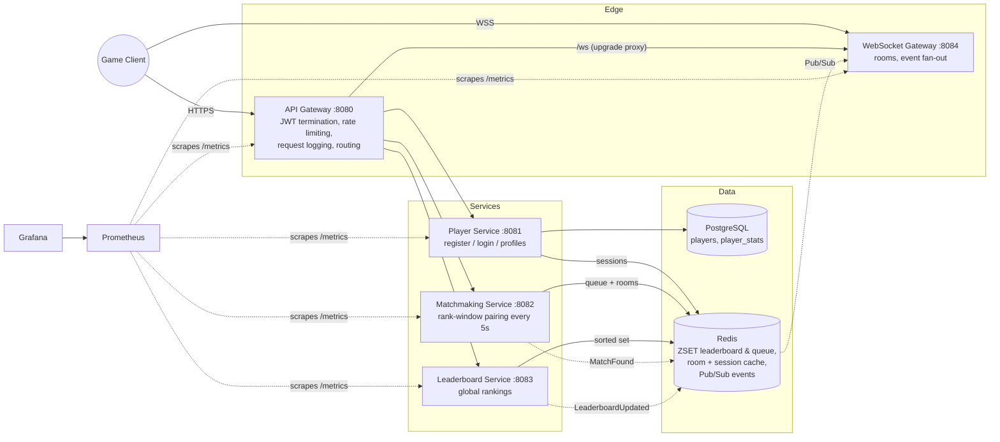
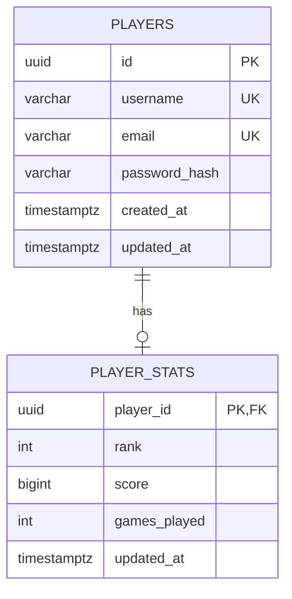

# GameMesh — Scalable Game Backend Framework

A production-grade multiplayer game backend built with Go microservices: player
management, JWT authentication, rank-based matchmaking, real-time Redis
leaderboards, WebSocket event delivery, full Prometheus/Grafana observability,
and Docker/Kubernetes deployment.

> Portfolio project demonstrating distributed-systems engineering for
> large-scale online games. Designed so each component has a documented path
> from "runs on my laptop" to "supports millions of players".

## Architecture



### ER diagram



### Key design decisions

| Decision | Rationale |
|---|---|
| **Gateway terminates JWT, forwards `X-User-ID`** | Auth logic lives in one place; internal services stay simple and are only reachable on the cluster network. The WS service is the exception (browsers can't set headers on upgrade), so it validates tokens itself. |
| **Redis ZSET for leaderboard** | `ZADD`/`ZREVRANK` are O(log n), `ZREVRANGE` O(log n + m) — meets the complexity requirement at millions of members. |
| **Redis ZSET for matchmaking queue (score = rank)** | The queue is permanently sorted by rank, so each 5s tick pairs adjacent players in O(n) with no sort step. |
| **Redis Pub/Sub for events behind `Publisher`/`Subscriber` interfaces** | Realtime fan-out where a missed message is repaired by the next poll/tick. Swapping to NATS/Kafka/gRPC = one new implementation of two small interfaces, zero service changes. |
| **Sessions in Redis keyed by JWT ID (JTI)** | `SET ... EX` matches session lifetime to token expiry automatically and enables server-side logout for otherwise stateless JWTs. |
| **`player_stats` split from `players`** | Hot gameplay writes (rank/score) never contend with the identity row. |
| **One matchmaking replica** | The match loop needs a leader lock to scale out (documented in the manifest); a single replica handles thousands of matches/tick. |
| **Per-service Prometheus registry** | No global-registry collisions in tests; only intentional metrics exposed. |

Full discussion: [docs/architecture.md](docs/architecture.md)

## Tech stack

Go 1.23 · Gin · GORM · PostgreSQL 16 · Redis 7 · Gorilla WebSocket ·
golang-jwt v5 · zap · Prometheus · Grafana · Docker Compose · Kubernetes
(Minikube) · Testcontainers · k6 · GitHub Actions

## Repository layout

```
cmd/            entrypoints: gateway, player, matchmaking, leaderboard, websocket
internal/       service-private logic (handlers → services → repositories)
pkg/            shared libraries: auth, config, events, logger, metrics, middleware, server
migrations/     versioned SQL migrations (up/down)
scripts/db/     schema.sql + seed.sql (auto-loaded by compose)
scripts/k6/     load-test scripts
deployments/    Dockerfiles + Kubernetes manifests
config/         Prometheus + Grafana provisioning
tests/          Testcontainers integration tests
docs/           architecture, API, deployment, troubleshooting
```

## Quick start (Docker — one command)

```bash
cp .env.example .env      # optional; everything has dev defaults
docker compose up --build
```

| URL | What |
|---|---|
| http://localhost:8080 | API Gateway |
| ws://localhost:8084/ws?token=… | WebSocket Gateway |
| http://localhost:9090 | Prometheus |
| http://localhost:3000 | Grafana (admin/admin) — "GameMesh Overview" dashboard pre-provisioned |

### Smoke test

```bash
# Register + login
curl -s localhost:8080/api/v1/auth/register -d '{"username":"neo","email":"neo@example.com","password":"password123"}'
TOKEN=$(curl -s localhost:8080/api/v1/auth/login -d '{"identifier":"neo","password":"password123"}' | jq -r .token)

# Submit a score, read the leaderboard
curl -s localhost:8080/api/v1/score -H "Authorization: Bearer $TOKEN" -d '{"score":150,"increment":true}'
curl -s localhost:8080/api/v1/leaderboard/top/10

# Queue for a match (two players within rank window get paired within 5s)
curl -s localhost:8080/api/v1/queue -H "Authorization: Bearer $TOKEN" -d '{"rank":1000}'

# Live events
npx wscat -c "ws://localhost:8084/ws?token=$TOKEN"
```

## Local development (no Docker)

```bash
# Needs local PostgreSQL + Redis (or: docker compose up postgres redis)
go run ./cmd/player & go run ./cmd/leaderboard & go run ./cmd/matchmaking &
go run ./cmd/websocket & go run ./cmd/gateway
```

## Kubernetes (Minikube)

```bash
minikube start
minikube addons enable ingress

make k8s-build     # builds images inside Minikube's Docker daemon
make k8s-apply     # kubectl apply -f deployments/k8s/

kubectl -n gamemesh get pods
kubectl -n gamemesh logs deploy/gateway -f
kubectl -n gamemesh port-forward svc/gateway 8080:8080
kubectl -n gamemesh port-forward svc/grafana 3000:3000
```

Full guide with ingress/hosts setup: [docs/deployment.md](docs/deployment.md)

## Testing

```bash
make test               # unit tests, -race, coverage
make test-integration   # Testcontainers: real PostgreSQL + Redis (needs Docker)
make lint               # golangci-lint
```

## Load testing (k6)

```bash
make k6-leaderboard     # 10,000 leaderboard updates
make k6-matchmaking     # ramp to 5,000 concurrent matchmaking players
make k6-websocket       # 1,000 concurrent WebSocket clients
```

JSON summaries land in `scripts/k6/reports/`.

## Observability

- Every service exposes `/metrics` (Prometheus) and `/healthz`.
- Metrics: request count/errors/latency histograms per route, active WS
  connections, matchmaking queue depth, matches created, leaderboard updates.
- Structured zap logs with `service`, `request_id`, `user_id`, latency and
  error fields on every request — sample logs in [docs/architecture.md](docs/architecture.md#sample-logs).
- Grafana dashboard auto-provisioned in compose; for any other Grafana:
  *Dashboards → Import → upload `config/grafana/dashboards/gamemesh.json`*,
  pick the Prometheus datasource.

## Screenshots

| | |
|---|---|
|  *(placeholder)* |  *(placeholder)* |

## Documentation

- [Architecture & design decisions](docs/architecture.md)
- [API reference](docs/api.md)
- [Deployment guide](docs/deployment.md)
- [Troubleshooting](docs/troubleshooting.md)

## License

MIT
