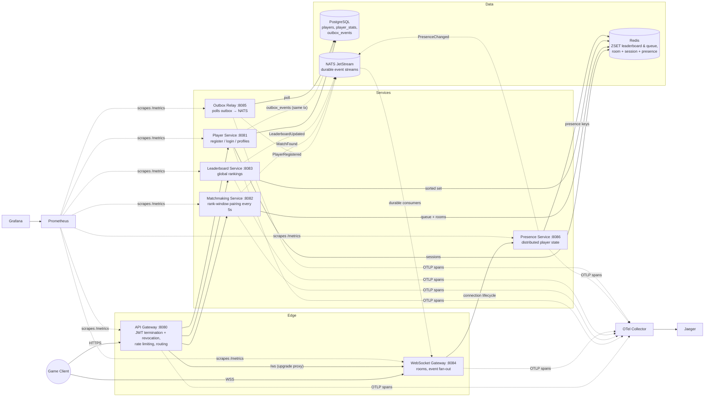
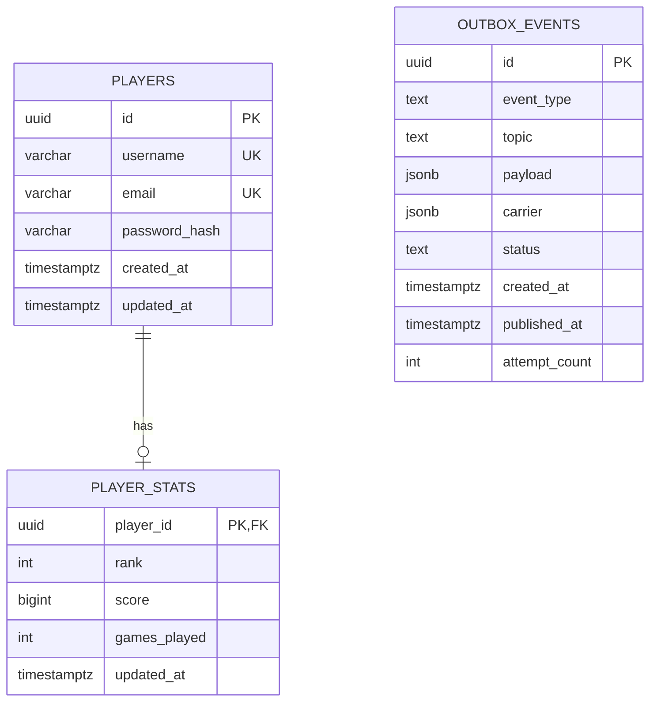

# GameMesh — Scalable Game Backend Framework

A production-grade multiplayer game backend built with Go microservices: player
management, JWT authentication with server-side revocation, rank-based
matchmaking, real-time Redis leaderboards, a distributed presence layer,
WebSocket event delivery, durable NATS JetStream messaging with a transactional
outbox, full Prometheus/Grafana metrics and OpenTelemetry distributed tracing,
and Docker/Kubernetes deployment.

> Portfolio project demonstrating distributed-systems engineering for
> large-scale online games. Designed so each component has a documented path
> from "runs on my laptop" to "supports millions of players".

## Architecture



### ER diagram



### Key design decisions

| Decision | Rationale |
|---|---|
| **Gateway terminates JWT, forwards `X-User-ID`** | Auth logic lives in one place; internal services stay simple and are only reachable on the cluster network. The WS service is the exception (browsers can't set headers on upgrade), so it validates tokens itself. |
| **Session revocation with a short-TTL in-process cache** | Every authenticated request must honour logout, but a Redis round-trip per request is a hot-path cost. A 5s positive cache (`SESSION_CACHE_TTL`) bounds the window a revoked token stays usable on one replica; `Delete` evicts locally at once. |
| **Redis ZSET for leaderboard** | `ZADD`/`ZREVRANK` are O(log n), `ZREVRANGE` O(log n + m) — meets the complexity requirement at millions of members. |
| **Redis ZSET for matchmaking queue (score = rank)** | The queue is permanently sorted by rank, so each 5s tick pairs adjacent players in O(n) with no sort step. |
| **NATS JetStream for events behind `Publisher`/`Subscriber`** | Durable, replayable, at-least-once delivery with explicit ACK/NAK — a `MatchFound` lost in transit is a correctness bug, not a cosmetic one. `EVENT_BUS=redis` still selects the original Pub/Sub transport; the two interfaces are unchanged. |
| **Transactional outbox for player events** | The business row and its event are written in **one** Postgres transaction; the relay publishes asynchronously. No ordering of two independent writes is safe — the outbox removes the dual-write problem entirely. |
| **Relay HA via `FOR UPDATE SKIP LOCKED`** | Multiple relay replicas poll the same table without a leader election or duplicate publishes — each replica claims a disjoint row set. |
| **Presence as its own service, not a WS-gateway flag** | Presence is a full state machine (`ONLINE`/`IN_QUEUE`/`IN_MATCH`/`AWAY`/`OFFLINE`), not a boolean. Owning it separately keeps the WS gateway decoupled and lets friends/parties/invites build on the same events. |
| **Presence TTL + heartbeat, missing key = offline** | A crashed client can't send a goodbye. A 45s TTL refreshed every 15s makes the view self-healing with no reaper job. |
| **Batched matchmaking I/O and bulk heartbeats** | The match tick and the WS gateway's heartbeat both pipeline their Redis calls, turning per-player round-trips into one batched command per tick. |
| **`player_stats` split from `players`** | Hot gameplay writes (rank/score) never contend with the identity row. |
| **One matchmaking replica** | The match loop needs a leader lock to scale out (documented in the manifest); a single replica handles thousands of matches/tick. |
| **Per-service Prometheus registry** | No global-registry collisions in tests; only intentional metrics exposed. |
| **Trace context carried inside the event envelope** | Every event has a `Carrier` field holding W3C trace headers, so a trace survives Redis, NATS *and* the outbox's DB round-trip — one trace spans HTTP → Postgres → relay → NATS → WebSocket. |

Full discussion: [docs/architecture.md](docs/architecture.md)

## Tech stack

Go 1.25 · Gin · GORM · PostgreSQL 16 · Redis 7 · NATS JetStream ·
Gorilla WebSocket · golang-jwt v5 · zap · Prometheus · Grafana ·
OpenTelemetry · Jaeger · Docker Compose · Kubernetes (Minikube) ·
Testcontainers · k6 · GitHub Actions

## Services

| Service | Port | Responsibility |
|---|---|---|
| `gateway` | 8080 | JWT termination + revocation check, rate limiting, CORS, reverse proxy, WS upgrade passthrough |
| `player` | 8081 | Registration, login/logout, profiles, `player_stats`, outbox writes |
| `matchmaking` | 8082 | Rank-window queue, 5s pairing tick, room creation, stale-entry eviction |
| `leaderboard` | 8083 | Score submission, global rankings, rank lookup |
| `websocket` | 8084 | Client connections, rooms, event fan-out, presence feed |
| `outbox-relay` | 8085 | Polls `outbox_events`, publishes to NATS, retries, dead-letters |
| `presence` | 8086 | Presence state machine, heartbeats, friend presence lookup |

## Repository layout

```
cmd/            entrypoints: gateway, player, matchmaking, leaderboard,
                websocket, presence, outbox-relay
internal/       service-private logic (handlers → services → repositories)
                gateway, player, matchmaking, leaderboard, wsgateway,
                presence, outbox
pkg/            shared libraries: auth, config, events, httpx, logger,
                metrics, middleware, server, tracing
migrations/     versioned SQL migrations (up/down), incl. outbox + dead-letter
scripts/db/     schema.sql + seed.sql (auto-loaded by compose)
scripts/k6/     load-test scripts
scripts/wsclient/  small WebSocket probe client
deployments/    Dockerfiles + Kubernetes manifests
config/         Prometheus + Grafana + OTel Collector provisioning
tests/          Testcontainers integration tests
docs/           architecture, API, messaging, outbox, presence,
                observability, deployment, troubleshooting
```

## Quick start (Docker — one command)

```bash
cp .env.example .env      # optional; everything has dev defaults
docker compose up --build
```

| URL | What |
|---|---|
| http://localhost:8080 | API Gateway |
| ws://localhost:8084/ws?token=… | WebSocket Gateway |
| http://localhost:16686 | Jaeger — distributed traces |
| http://localhost:9090 | Prometheus |
| http://localhost:3000 | Grafana (admin/admin) — "GameMesh Overview" dashboard pre-provisioned |
| http://localhost:8222 | NATS monitoring |

### Smoke test

```bash
# Register + login
curl -s localhost:8080/api/v1/auth/register -d '{"username":"neo","email":"neo@example.com","password":"password123"}'
TOKEN=$(curl -s localhost:8080/api/v1/auth/login -d '{"identifier":"neo","password":"password123"}' | jq -r .token)

# Submit a score, read the leaderboard
curl -s localhost:8080/api/v1/score -H "Authorization: Bearer $TOKEN" -d '{"score":150,"increment":true}'
curl -s localhost:8080/api/v1/leaderboard/top/10

# Queue for a match (two players within rank window get paired within 5s)
curl -s localhost:8080/api/v1/queue -H "Authorization: Bearer $TOKEN" -d '{"rank":1000}'

# Presence (internal service, addressed directly)
curl -s localhost:8086/presence/<player-id>

# Live events
npx wscat -c "ws://localhost:8084/ws?token=$TOKEN"

# Then open Jaeger (:16686) and pick the "gateway" service to see the
# request traced end to end, including the async NATS hop.
```

## Local development (no Docker)

```bash
# Needs local PostgreSQL + Redis + NATS (or: docker compose up postgres redis nats)
go run ./cmd/player & go run ./cmd/leaderboard & go run ./cmd/matchmaking &
go run ./cmd/presence & go run ./cmd/outbox-relay & go run ./cmd/websocket &
go run ./cmd/gateway
```

Tracing dials the OTLP endpoint on startup; set `OTEL_ENABLED=false` when
running without a collector — the code paths stay identical, spans just become
non-recording.

## Messaging & the transactional outbox

Inter-service events flow over **NATS JetStream** (durable, at-least-once,
replayable) behind the `events.Publisher` / `events.Subscriber` interfaces.
`EVENT_BUS=redis` switches back to the original Pub/Sub transport without
touching a single service.

Player identity events use the **transactional outbox**: the player service
inserts into `outbox_events` in the same transaction as the business write, and
the `outbox-relay` service polls, publishes and marks rows published. Failed
publishes are retried and eventually dead-lettered. Relay replicas coordinate
purely through `FOR UPDATE SKIP LOCKED`, so scaling out needs no leader lock.

| Topic | Events |
|---|---|
| `events.player` | `PlayerRegistered`, `PlayerUpdated` (via outbox) |
| `events.matchmaking` | `MatchFound` |
| `events.leaderboard` | `LeaderboardUpdated` |
| `events.presence` | `PresenceOnline`, `PresenceOffline`, `PresenceStateChanged` |

Details: [docs/messaging.md](docs/messaging.md) · [docs/outbox.md](docs/outbox.md)

## Presence

A dedicated service maintaining *where* each player is, not just whether they
are online:

```
OFFLINE → ONLINE → IN_QUEUE → IN_MATCH → ONLINE → …  (AWAY from any state)
```

Presence keys carry a 45s TTL refreshed by 15s heartbeats, so a missing key
**is** offline and a crashed client heals itself with no reaper job. The WS
gateway feeds connection lifecycle over HTTP and batches heartbeats for all its
connections into one bulk call. Only `OFFLINE → IN_QUEUE` and
`OFFLINE → IN_MATCH` are rejected; everything else is permitted so future
reconnect/party/rematch flows never require editing the state machine.

Details: [docs/presence.md](docs/presence.md)

## Kubernetes (Minikube)

```bash
minikube start
minikube addons enable ingress

make k8s-build     # builds images inside Minikube's Docker daemon
make k8s-apply     # kubectl apply -f deployments/k8s/

kubectl -n gamemesh get pods
kubectl -n gamemesh logs deploy/gateway -f
kubectl -n gamemesh port-forward svc/gateway 8080:8080
kubectl -n gamemesh port-forward svc/grafana 3000:3000
```

Full guide with ingress/hosts setup: [docs/deployment.md](docs/deployment.md)

## Testing

```bash
make test               # unit tests, -race, coverage
make test-integration   # Testcontainers: real PostgreSQL + Redis (needs Docker)
make lint               # golangci-lint
```

## Load testing (k6)

```bash
make k6-leaderboard     # 10,000 leaderboard updates
make k6-matchmaking     # ramp to 5,000 concurrent matchmaking players
make k6-websocket       # 1,000 concurrent WebSocket clients
```

JSON summaries land in `scripts/k6/reports/`.

Each script provisions a pool of real accounts in `setup()` (register + login,
in parallel batches of 25 — login is bcrypt-bound, so larger batches only queue
behind the same cores). **`POOL` must be >= the VU count:**

```bash
POOL=500 k6 run --vus 500 --duration 1m scripts/k6/matchmaking.js
```

Matchmaking identity comes from the JWT and the queue is a Redis ZSET keyed by
player ID, so two VUs sharing a token are the *same* queue member — one VU's
`DELETE /queue` would evict the other's ticket and the run would measure a
self-inflicted race rather than the system.

### Two things to know before citing numbers

**The gateway rate-limits per client IP** (`RATE_LIMIT_RPS`, default 50). k6
generates all traffic from one IP, so the entire load generator shares a single
50 rps budget — a test-harness artifact, since real players arrive from distinct
IPs. Above ~50 rps an unmodified run measures the rate limiter, not the system:
at 500 VUs (204 rps offered) it returns **80% HTTP 429** with sub-5ms rejects.
Raise the limit *for the load-test run only* to measure the services:

```bash
RATE_LIMIT_RPS=20000 RATE_LIMIT_BURST=40000 docker compose up -d --no-deps gateway
# ... run k6 ...
docker compose up -d --no-deps gateway   # restore committed defaults
```

**This is a realistic-usage scenario, not a throughput benchmark.** Each
matchmaking iteration includes ~7s of sleep modelling a player waiting for the
5s match tick, so offered load is roughly VUs/7 iterations per second. The
numbers below describe how the system behaves under a realistic arrival pattern;
they are *not* a maximum-throughput figure and should not be quoted as one.

### Measured results

At 500 VUs, `POOL=500`, rate limit raised as above:

| scenario | VUs | iterations | reqs/s | p95 | errors | host CPU (avg of 1400%) |
|---|---|---|---|---|---|---|
| matchmaking | 500 | 6,500 | 193 | 112 ms | 0.00% | 238% |
| leaderboard | 500 | 4,000 | 133 | 208 ms | 0.00% | 508% |
| websocket | 500 | 549 | — | 35.7 ms *(`ws_connecting`)* | 0.00% | 203% |

Matchmaking matched 100% of players before timeout. WebSocket held 549 sessions
averaging 44.3s with 100% of checks passing — `ws_connecting` is the meaningful
latency there, not `http_req_*`, which covers only setup traffic.

**500 VUs is the honest level to cite on this hardware.** Above it the host, not
the system, is what's being measured — at 1000 VUs a Jaeger trace shows the
server spending **21 ms** at p95 while k6 observes **204 ms**, and the slowest of
800 traces spends **99.2% of its wall clock in gaps between spans** (queueing)
against **267 µs** of actual Redis work. The load generator's own `setup()` is a
large part of that: `POOL` scales with VUs, and hashing that many passwords at
`bcryptCost=12` keeps the player service at ~505% CPU for the whole run. At
2,000 VUs throughput inverts outright (266 → 250 req/s, p95 5.65 s, host CPU
1506% of 1400%).

Environment: a single laptop (14 CPU / 24 GB, Docker VM 14 CPU / 8 GB) running
**everything at once** — the k6 load generator, all seven services, Redis,
PostgreSQL, NATS, Prometheus and Jaeger. The load generator competes with the
system under test for the same cores, so these figures are a lower bound on
what dedicated hosts would show, not a capacity limit.

> When investigating a suspected Redis pool bottleneck, read
> `rdb.PoolStats()` — `Timeouts` and `WaitCount` say directly whether callers
> ever *waited* for a connection. Counting open connections (via `CLIENT LIST`)
> does not: a pool sitting near its ceiling is not evidence of contention.

## Observability

Three signals, wired into every service:

**Metrics** — each service exposes `/metrics` on its own Prometheus registry
and `/healthz`. Beyond per-route request/error/latency histograms: active WS
connections, matchmaking queue depth and matches created, leaderboard updates,
events published/consumed/failed with processing duration, presence online
players and state transitions, outbox pending depth, publish failures and
dead-letters.

**Tracing** — OpenTelemetry across all seven services, exported over OTLP/gRPC
to a Collector and on to Jaeger (`:16686`). Automatic instrumentation covers
Gin (`otelgin`), the gateway's proxy transport (`otelhttp`), Redis
(`redisotel`) and Postgres/GORM (`otelgorm`, with query variables excluded so
bound parameters never reach a span). Manual spans wrap the interesting
business paths — the matchmaking tick, presence transitions, outbox
poll/publish. Because trace context travels inside the event envelope's
`Carrier`, a single trace spans HTTP → Postgres → relay → NATS → WebSocket.

Sampling is env-driven and follows the OTel spec (`OTEL_TRACES_SAMPLER`,
`OTEL_TRACES_SAMPLER_ARG`). High-volume event types
(`TRACE_HIGHVOLUME_EVENTS`, default `LeaderboardUpdated`) have their consumer
spans sampled down to 1% while **trace context is still propagated** — the
chain never breaks, only the recording stops. `OTEL_ENABLED=false` installs a
no-op provider, so no call site needs a nil check.

**Logs** — structured zap with `service`, `request_id`, `user_id`, latency and
error fields, plus `trace_id`/`span_id` on every request so a log line jumps
straight to its Jaeger trace. Log sampling (`LOG_SAMPLE_INITIAL` /
`LOG_SAMPLE_THEREAFTER`) keeps the first N identical entries per second in full
and then thins the rest.

Grafana's dashboard is auto-provisioned in compose; for any other Grafana:
*Dashboards → Import → upload `config/grafana/dashboards/gamemesh.json`*, pick
the Prometheus datasource.

Details: [docs/observability.md](docs/observability.md)

## Configuration

Everything is env-driven with working dev defaults — see
[.env.example](.env.example) for the annotated list. The knobs worth knowing:

| Variable | Default | What |
|---|---|---|
| `EVENT_BUS` | `nats` | `nats` (JetStream) or `redis` (Pub/Sub) |
| `OUTBOX_ENABLED` | `true` | Gates the relay loop; the player service always writes events |
| `OUTBOX_BATCH_SIZE` / `OUTBOX_WORKERS` | `100` / `4` | Rows per poll, bounded publish-worker pool |
| `MATCH_INTERVAL_SECONDS` / `MATCH_RANK_WINDOW` | `5` / `100` | Pairing tick and rank tolerance |
| `PRESENCE_TTL` / `PRESENCE_HEARTBEAT_INTERVAL` | `45s` / `15s` | Presence expiry and refresh cadence |
| `SESSION_CACHE_ENABLED` / `SESSION_CACHE_TTL` | `true` / `5s` | Revocation-check cache; TTL is the worst-case revocation lag |
| `OTEL_ENABLED` / `OTEL_EXPORTER_OTLP_ENDPOINT` | `true` / `otel-collector:4317` | Tracing on/off and destination |
| `TRACE_HIGHVOLUME_EVENTS` / `TRACE_HIGHVOLUME_SAMPLE_RATIO` | `LeaderboardUpdated` / `0.01` | Per-event-type consumer-span sampling |
| `RATE_LIMIT_RPS` / `RATE_LIMIT_BURST` | `50` / `100` | Gateway rate limiting |
| `REDIS_POOL_SIZE` | `0` | go-redis pool cap; `0` keeps go-redis's own sizing (10×GOMAXPROCS, so it tracks available cores) |

## Documentation

- [Architecture & design decisions](docs/architecture.md)
- [API reference](docs/api.md)
- [Messaging & event transport](docs/messaging.md)
- [Transactional outbox](docs/outbox.md)
- [Presence service](docs/presence.md)
- [Observability (metrics, tracing, logs)](docs/observability.md)
- [Deployment guide](docs/deployment.md)
- [Troubleshooting](docs/troubleshooting.md)
- [Design document](docs/design-document.md)

## License

MIT
